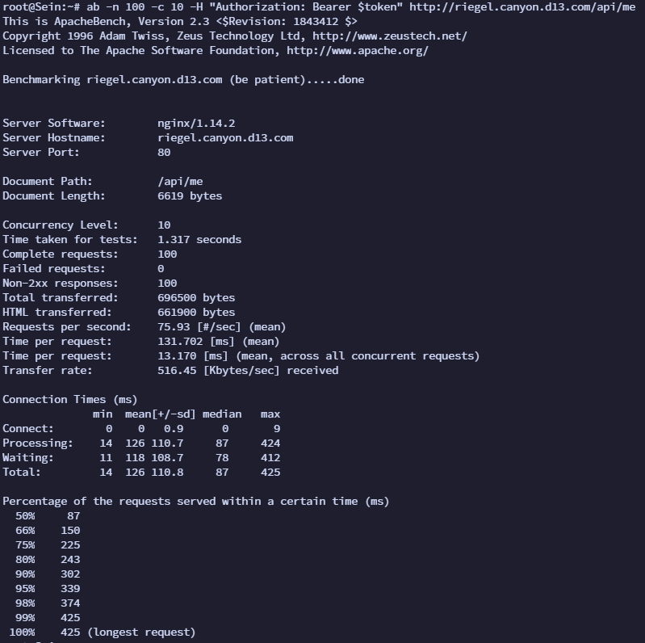

# Jarkom-Modul-3-D13-2023
<table>
<tbody>
  <thead>
    <tr>
      <th>Name</th>
      <th>NRP</th>
    </tr>
  </thead>
  <tbody>
    <tr>
      <td>Thalent Athalla Razzaq</td>
      <td>5025211101</td>
    </tr>
    <tr>
      <td> Jawahirul Wildan </td>
      <td> 5025211150 </td>
  </tbody>
</table>

Soal Dapat diakses pada [Soal Praktikum Modul 3](https://docs.google.com/document/d/1ST6INlp2SThwfF0GA5Ox7hD7yZqdc6BYcwmMkQmSqJU/edit?usp=sharing)
## Topologi


## Soal 0
Setelah mengalahkan Demon King, perjalanan berlanjut. Kali ini, kalian diminta untuk melakukan register domain berupa riegel.canyon.yyy.com untuk worker Laravel dan granz.channel.yyy.com untuk worker PHP (0) mengarah pada worker yang memiliki IP [prefix IP].x.1.
### Penyelesaian

## Soal 1
Lakukan konfigurasi sesuai dengan peta yang sudah diberikan.<br>
Semua CLIENT harus menggunakan konfigurasi dari DHCP Server
### Penyelesaian
- Pertama, buat konfigurasi untuk masing masing node seperti dibawah ini

**AURA**
```
auto eth0
iface eth0 inet dhcp

auto eth1
iface eth1 inet static
        address 10.28.1.212
        netmask 255.255.255.0

auto eth2
iface eth2 inet static
        address 10.28.2.212
        netmask 255.255.255.0

auto eth3
iface eth3 inet static
        address 10.28.3.212
        netmask 255.255.255.0

auto eth4
iface eth4 inet static
        address 10.28.4.212
        netmask 255.255.255.0
```

**HIMMEL**
```
auto eth0
iface eth0 inet static
        address 10.28.1.2
        netmask 255.255.255.0
        gateway 10.28.1.212
```

**HEITER**
```
auto eth0
iface eth0 inet static
        address 10.28.1.3
        netmask 255.255.255.0
        gateway 10.28.1.212
```

**DENKEN**
```
auto eth0
iface eth0 inet static
        address 10.28.2.2
        netmask 255.255.255.0
        gateway 10.28.2.212
```

**EISEN**
```
auto eth0
iface eth0 inet static
        address 10.28.2.3
        netmask 255.255.255.0
        gateway 10.28.2.212
```

**FRIEREN**
```
auto eth0
iface eth0 inet dhcp
hwaddress ether 56:6a:83:63:d7:c6
```

**FLAMME**
```
auto eth0
iface eth0 inet dhcp
hwaddress ether e6:75:9c:8b:0b:5a
```

**FERN**
```
auto eth0
iface eth0 inet dhcp
hwaddress ether a6:2c:35:70:87:e5
```

**LAWINE**
```
auto eth0
iface eth0 inet dhcp
hwaddress ether ea:5a:0a:d2:95:9b
```

**LINIE**
```
auto eth0
iface eth0 inet dhcp
hwaddress ether 6e:d1:02:4e:c0:34
```

**LUGNER**
```
auto eth0
iface eth0 inet dhcp
hwaddress ether 22:ac:71:57:d9:ff
```

**REVOLTE**
```
auto eth0
iface eth0 inet dhcp
hwaddress ether b6:a7:5c:52:c2:22pt 
```

**RICHTER**
```
auto eth0
iface eth0 inet dhcp
hwaddress ether 86:71:c7:4c:c2:94
```

**SEIN**
```
auto eth0
iface eth0 inet dhcp
hwaddress ether 7e:bd:6b:4a:15:6e
```

**STARK**
```
auto eth0
iface eth0 inet dhcp
hwaddress ether 6e:c2:ea:74:e6:e8
```

- Kedua, karena semua CLIENT akan menggunakan konfigurasi dari DHCP Server, maka pada node Himmel(DHCP Server) perlu di install isc-dhcp-server, dengan cara sebagai berikut
```
apt-get update
apt-get install isc-dhcp-server -y
```

- Ketiga, tentukan interface yang akan diberikan layanan DHCP dengan cara mengedit file pada direktori ```/etc/default/isc-dhcp-server```
```
INTERFACESv4="eth0"
INTERFACESv6=""
```
- Keempat, lakukan konfigurasi pada DHCP Server pada direktori ```/etc/dhcp/dhcpd.conf``` tambahkan script seperti dibawah ini

```
subnet 10.28.1.0 netmask 255.255.255.0 {
}
subnet 10.28.2.0 netmask 255.255.255.0 {
}
subnet 10.28.3.0 netmask 255.255.255.0 {
}
subnet 10.28.4.0 netmask 255.255.255.0 {
}
```
- Kelima, lakukan konfigurasi DHCP Relay pada node Aura, lakukan instalasi terlebih dahulu
```
apt-get update
apt-get install isc-dhcp-relay -y
```
- Keenam, lakukan konfigurasi pada direktori ```/etc/default/isc-dhcp-relay``` seperti berikut
```
SERVERS="10.28.1.2"
INTERFACES="eth1 eth2 eth3 eth4"
OPTIONS=""
```
- Ketujuh, lakukan konfigurasi IP Forwarding pada ```/etc/sysctl.conf``` seperti berikut
```
net.ipv4.ip_forward=1
```
- Ketujuh, lakukan restart service pada ```isc-dhcp-relay``` dengan perintah
```
service isc-dhcp-relay restart
```
## Soal 2
Client yang melalui Switch3 mendapatkan range IP dari [prefix IP].3.16 - [prefix IP].3.32 dan [prefix IP].3.64 - [prefix IP].3.80
### Penyelesaian
- Pertama, edit file di node Himmel pada direktori ```/etc/dhcp/dhcpd.conf```, edit script seperti dibawah ini
```
subnet 10.28.3.0 netmask 255.255.255.0 {
    range 10.28.3.16 10.28.3.32;
    range 10.28.3.64 10.28.3.80;
    option routers 10.28.3.212;
    option broadcast-address 10.28.3.255;
}
```
## Soal 3
Client yang melalui Switch4 mendapatkan range IP dari [prefix IP].4.12 - [prefix IP].4.20 dan [prefix IP].4.160 - [prefix IP].4.168
### Penyelesaian
- Pertama, edit file di node Himmel pada direktori ```/etc/dhcp/dhcpd.conf```, edit script seperti dibawah ini
```
subnet 10.28.4.0 netmask 255.255.255.0 {
    range 10.28.4.12 10.28.4.20;
    range 10.28.4.160 10.28.4.168;
    option routers 10.28.4.212;
    option broadcast-address 10.28.4.255;
}
```
## Soal 4
Client mendapatkan DNS dari Heiter dan dapat terhubung dengan internet melalui DNS tersebut 
### Penyelesaian
- Pertama, edit file di node Himmel pada direktori ```/etc/dhcp/dhcpd.conf```, tambahkan script dibawah ini ke dalam ```subnet 10.28.3.0 netmask 255.255.255.0 {}``` dan ```subnet 10.28.4.0 netmask 255.255.255.0 {}```
```
option domain-name-servers 10.28.1.3;
```
Seperti dibawah ini<br>

## Soal 5
Lama waktu DHCP server meminjamkan alamat IP kepada Client yang melalui Switch3 selama 3 menit sedangkan pada client yang melalui Switch4 selama 12 menit. Dengan waktu maksimal dialokasikan untuk peminjaman alamat IP selama 96 menit (satuan waktu diubah kedalam detik)
### Penyelesaian
- Pertama, edit file di node Himmel pada direktori ```/etc/dhcp/dhcpd.conf```, tambahkan script dibawah ini ke dalam ```subnet 10.28.3.0 netmask 255.255.255.0 {}```
```
default-lease-time 180;
max-lease-time 5760;
```
- Kedua, edit file di node Himmel pada direktori ```/etc/dhcp/dhcpd.conf```, tambahkan script dibawah ini ke dalam ```subnet 10.28.4.0 netmask 255.255.255.0 {}```
```
default-lease-time 720;
max-lease-time 5760;
```
Seperti dibawah ini<br>

## Soal 6
Pada masing-masing worker PHP, lakukan konfigurasi virtual host untuk website berikut dengan menggunakan php 7.3
### Penyelesaian
- Pertama, untuk ketiga node Worker PHP yaitu Lawine, Linie, dan Lugner, lakukan instalasi paket terlebih dahulu dengan perintah
```
apt-get update
apt-get install wget unzip nginx php7.3 php7.3-fpm -y

```
- Kedua, download file requirement yaitu granz.channel.yyy.com.zip dengan perintah
```
wget --no-check-certificate 'https://docs.google.com/uc?export=download&id=1ViSkRq7SmwZgdK64eRbr5Fm1EGCTPrU1' -O granz.zip
```
lalu unzip file dengan ```unzip granz.zip```<br> 
lalu pindah file yang telah diunzip ```mv modul-3 /var/www/granz.channel.d13```<br>
lalu hapus file zip ```rm granz.zip```
- Ketiga, edit file(konfigurasi server) pada direktori /etc/nginx/sites-available/jarkom, seperti dibawah ini :
```
server {
        listen 80;

        root /var/www/granz.channel.d13;
        index index.php index.html index.htm;
        server_name granz.channel.d13.com;

        location / {
              try_files $uri $uri/ /index.php?$query_string;
        }

        # pass PHP scripts to FastCGI server
        location ~ \.php$ {
        include snippets/fastcgi-php.conf;
        fastcgi_pass unix:/var/run/php/php7.3-fpm.sock;
        }

	location ~ /\.ht {
                deny all;
        }

        error_log /var/log/nginx/jarkom_error.log;
        access_log /var/log/nginx/jarkom_access.log
}
```

- Keempat, simpan file, kemudian buat ```symlink```
```
ln -s /etc/nginx/sites-available/granz.channel.d13 /etc/nginx/sites-enabled
```

- Kelima, remove file default dengan cara
```
rm -rf /etc/nginx/sites-enabled/default
```
- Keenam, restart nginx dan start php-fpm
```
service nginx restart

service php7.3-fpm start
```
- Ketujuh, pada node Eisen (Load Balancer) lakukan instalasi paaket dengan perintah 
```
apt-get update
apt install nginx php php-fpm -y
```
- Kedelapan, buatlah file baru di direktori ```/etc/nginx/sites-available``` dengan nama ```load-balancer```, lalu isi dengan
```
upstream myweb  {

        server 10.28.3.1;
        server 10.28.3.2;
        server 10.28.3.3;
}

server {

        listen 80;

        server_name granz.channel.d13.com;

        location / {
                proxy_pass http://myweb;
        }
 }
```
- Kesembilan, simpan file, kemudian buat symlink
```
ln -s /etc/nginx/sites-available/load-balancer /etc/nginx/sites-enabled
```

- Kesepuluh, remove file default dengan cara
```
rm -r /etc/nginx/sites-enabled/default
```
- Kesebelas, restart nginx
```
service nginx restart
```
## Soal 7
Kepala suku dari Bredt Region memberikan resource server sebagai berikut:
- Lawine, 4GB, 2vCPU, dan 80 GB SSD.
- Linie, 2GB, 2vCPU, dan 50 GB SSD.
- Lugner 1GB, 1vCPU, dan 25 GB SSD.<br>
aturlah agar Eisen dapat bekerja dengan maksimal, lalu lakukan testing dengan 1000 request dan 100 request/second.
### Penyelesaian
- Pertama, menentukan besaran weight untuk setiap Worker PHP, kami menggunakan Weighted Round Robin 
```
Lawine = 1
Linie = 2
Lugner = 4
```
- Kedua, edit file di node Eisen(Load Balancer) pada direktori ```/etc/nginx/sites-available/load-balancer```, tambahkan script seperti dibawah ini
```
upstream myweb  {

        server 10.28.3.1 weight=1;
        server 10.28.3.2 weight=2;
        server 10.28.3.3 weight=4;
}
```
- Ketiga, restart nginx
```
service nginx restart
```
## Soal 8
Karena diminta untuk menuliskan grimoire, buatlah analisis hasil testing dengan 200 request dan 10 request/second masing-masing algoritma Load Balancer dengan ketentuan sebagai berikut:<br>
a. Nama Algoritma Load Balancer<br>
b. Report hasil testing pada Apache Benchmark<br>
c. Grafik request per second untuk masing masing algoritma. <br>
d. Analisis 
### Penyelesaian
- Pada PHP Worker, lakukan instalasi paket dengan perintah
  ```
  apt-get install htop -y
  ```
  Lalu, jalankan perintah
  ```
  htop
  ```
- Pada Client, lakukan instalasi paket dengan perintah
  ```
  apt-get update
  apt-get install apache2-utils
  ```
  Lalu, untuk testing menggunakan perintah
  ```
  ab -n 200 -c 10 http://granz.channel.d13.com/
  ```
- Weighted Round Robin
> Tambahkan weight di sebelah IP (jika belum ada)<br>
  Hasil Testing :<br>
  
  
- Least Connection
> Edit file pada direktori ``` /etc/nginx/sites-available/granz.channel.d13```. hapus weight(jika ada) dan tambahkan ```least_conn;``` di line 1 dalam fungsi ```upstream myweb{}```<br>
  Hasil Testing :<br>
  
  

- IP Hash
> Edit file pada direktori ``` /etc/nginx/sites-available/granz.channel.d13```. hapus weight(jika ada) dan tambahkan ```ip_hash;``` di line 1 dalam fungsi ```upstream myweb{}```<br>
  Hasil Testing :<br>
  
  
- Generic Hash
> Edit file pada direktori ``` /etc/nginx/sites-available/granz.channel.d13```. hapus weight(jika ada) dan tambahkan ```hash $request_uri consistent;``` di line 1 dalam fungsi ```upstream myweb{}```<br>
  Hasil Testing :<br>
  
  
- Grafik<br>
  
- Analisis
Setelah melakukan testing dengan 200 request dan 10 request/second menggunakan apache bencmark didapatkan hasil Request Per Second sebagai berikut<br>
a. Weighted Round Robin = 877,57<br>
b. Least Connection = 852,01<br>
c. IP Hash = 722,33<br>
d. Generic Hash = 411,61<br>

Dapat terlihat dari data diatas maupun pada grafik bahwa algoritma Weighted Round Robin memiliki nilai request per second yang paling tinggi diantara algoritma load balancing lainnya. Dengan kata lain algoritma tersebut efektif dalam menanggapi permintaan atau beban kerja yang diberikan. Agar kerja dari algoritma tersebut dapat maksimal dapat berupa menerima permintaan secara bergantian lalu dialokasikan ke server yang memiliki bobot(weight) yang lebih besar. Disusul dengan algoritma Least Connection yang memiliki perbedaan nilai yang sedikit. Dan dengan nilai request per second terendah yaitu generic hash, dimana menandakan algoritma tersebut mungkin tidak optimal mendistribusikan beban dalam konteks pengujian tersebut.<br>

Perbedaan nilai diatas dapat dipengaruhi oleh beberapa hal seperti konfigurasi server, jaringan, load balancer serta faktor lainnya.

## Soal 9
Dengan menggunakan algoritma Round Robin, lakukan testing dengan menggunakan 3 worker, 2 worker, dan 1 worker sebanyak 100 request dengan 10 request/second, kemudian tambahkan grafiknya pada grimoire.
### Penyelesaian
- Pada Client, untuk testing menggunakan perintah
  ```
  ab -n 100 -c 10 http://granz.channel.d13.com/
  ```
- Pada PHP Worker, dapat distop sesuai dengan kebutuhan testing
**Berikut Hasil Testingnya :**
- 3 Worker
  Hasil Testing :<br>
  
- 2 Worker
  Hasil Testing :<br>
  
- 1 Worker
  Hasil Testing :<br>
  
- Grafik <br>
  
- Analisis
Setelah melakukan testing dengan 100 request dan 10 request/second menggunakan apache bencmark didapatkan hasil Request Per Second sebagai berikut
a. 3 Worker = 2309,79
b. 2 Worker = 2142,57
c. 1 Worker = 1833,18

Dapat terlihat dari data diatas maupun pada grafik bahwa semakin banyak worker yang bekerja maka nilai request per second akan semakin tinggi. Hal tersebut menandakan bahwa dengan banyak nya worker maka permintaan atau beban kerja yang diberikan akan dihandle dengan lebih cepat dan efisien dibanding dengan worker yang sedikit. 

## Soal 10
Selanjutnya coba tambahkan konfigurasi autentikasi di LB dengan dengan kombinasi username: “netics” dan password: “ajkyyy”, dengan yyy merupakan kode kelompok. Terakhir simpan file “htpasswd” nya di /etc/nginx/rahasisakita/
### Penyelesaian
- Pertama, pada node Eisen (Load Balancer) lakukan instalasi paaket dengan perintah 
```
apt-get install apache2-utils -y
```
- Kedua, buat folder /etc/nginx/rahasiakita dengan perintah
```
mkdir /etc/nginx/rahasiakita
```
- Ketiga, buat file .httpasswd dengan perintah 
```
htpasswd -b -c /etc/nginx/rahasiakita/.htpasswd netics ajkd13
```
- Keempat, edit file pada direktori ```/etc/nginx/sites-available/load-balancer```, tambahkan script seperti dibawah ini
```
location / {
     proxy_pass http://myweb;
     auth_basic "Admin Area";
     auth_basic_user_file /etc/nginx/rahasiakita/.htpasswd;
}
```
- Kelima, restart nginx
```
service nginx restart
```
## Soal 11
Lalu buat untuk setiap request yang mengandung /its akan di proxy passing menuju halaman https://www.its.ac.id
### Penyelesaian

Menambahkan konfigurasi pada file ```/etc/nginx/sites-available/load-balancer``` sebagai berikut

```bash
location ~* /its {
                proxy_pass https://www.its.ac.id;
        }
```
Ketika mengakses ```http://granz.channel.d13.com/its``` maka akan diarahkan ke ```https://www.its.ac.id```


## Soal 12
Selanjutnya LB ini hanya boleh diakses oleh client dengan IP [Prefix IP].3.69, [Prefix IP].3.70, [Prefix IP].4.167, dan [Prefix IP].4.168.
### Penyelesaian

Menambahkan konfigurasi ```allow``` pada file ```/etc/nginx/sites-available/load-balancer``` sebagai berikut

```bash
location / {
                proxy_pass http://myweb;
                auth_basic "Admin Area";
                auth_basic_user_file /etc/nginx/rahasiakita/.htpasswd;

                allow 10.28.3.69;
                allow 10.28.3.70;
                allow 10.28.4.167;
                allow 10.28.4.168;
        }
```

Menyesuaikan IP masing-masing client pada file ```/etc/dhcp/dhcpd.conf``` sebagai berikut

```bash
host Revolte {
        hardware ethernet b6:a7:5c:52:c2:22;
        fixed-address 10.28.3.69;
}

host Richter {
        hardware ethernet 86:71:c7:4c:c2:94;
        fixed-address 10.28.3.70;
}

host Sein {
        hardware ethernet 7e:bd:6b:4a:15:6e;
        fixed-address 10.28.4.167;
}

host Stark {
        hardware ethernet 6e:c2:ea:74:e6:e8;
        fixed-address 10.28.4.168;
}
```

## Soal 13
Karena para petualang kehabisan uang, mereka kembali bekerja untuk mengatur riegel.canyon.yyy.com. Semua data yang diperlukan, diatur pada Denken dan harus dapat diakses oleh Frieren, Flamme, dan Fern.
### Penyelesaian

Melakukan konfigurasi pada file ```/etc/mysql/my.cnf``` sebagai berikut

```bash
# my.cnf

# The MariaDB configuration file
#
# The MariaDB/MySQL tools read configuration files in the following order:
# 1. "/etc/mysql/mariadb.cnf" (this file) to set global defaults,
# 2. "/etc/mysql/conf.d/*.cnf" to set global options.
# 3. "/etc/mysql/mariadb.conf.d/*.cnf" to set MariaDB-only options.
# 4. "~/.my.cnf" to set user-specific options.
#
# If the same option is defined multiple times, the last one will apply.
#
# One can use all long options that the program supports.
# Run program with --help to get a list of available options and with
# --print-defaults to see which it would actually understand and use.

#
# This group is read both both by the client and the server
# use it for options that affect everything
#
[client-server]

# Import all .cnf files from configuration directory
!includedir /etc/mysql/conf.d/
!includedir /etc/mysql/mariadb.conf.d/

[mysqld]

skip-networking=0

skip-bind-address
```

Melakukan konfigurasi pada file ```/etc/mysql/mariadb.conf.d/50-server.cnf``` sebagai berikut dengan mengubah ```bind-address``` menjadi ```0.0.0.0```

```bash
#50-server.cnf

#
# These groups are read by MariaDB server.
# Use it for options that only the server (but not clients) should see
#
# See the examples of server my.cnf files in /usr/share/mysql

# this is read by the standalone daemon and embedded servers
[server]

# this is only for the mysqld standalone daemon
[mysqld]

#
# * Basic Settings
#
user                    = mysql
pid-file                = /run/mysqld/mysqld.pid
socket                  = /run/mysqld/mysqld.sock
#port                   = 3306
basedir                 = /usr
datadir                 = /var/lib/mysql
tmpdir                  = /tmp
lc-messages-dir         = /usr/share/mysql
#skip-external-locking

# Instead of skip-networking the default is now to listen only on
# localhost which is more compatible and is not less secure.
bind-address            = 0.0.0.0

#
# * Fine Tuning
#
#key_buffer_size        = 16M
#max_allowed_packet     = 16M
#thread_stack           = 192K
#thread_cache_size      = 8
# This replaces the startup script and checks MyISAM tables if needed
# the first time they are touched
#myisam_recover_options = BACKUP
#max_connections        = 100
#table_cache            = 64
#thread_concurrency     = 10

#
# * Query Cache Configuration
#
#query_cache_limit      = 1M
query_cache_size        = 16M

#
# * Logging and Replication
#
# Both location gets rotated by the cronjob.
# Be aware that this log type is a performance killer.
# As of 5.1 you can enable the log at runtime!
#general_log_file       = /var/log/mysql/mysql.log
#general_log            = 1
#
# Error log - should be very few entries.
#
log_error = /var/log/mysql/error.log
#
# Enable the slow query log to see queries with especially long duration
#slow_query_log_file    = /var/log/mysql/mariadb-slow.log
#long_query_time        = 10
#log_slow_rate_limit    = 1000
#log_slow_verbosity     = query_plan
#log-queries-not-using-indexes
#
# The following can be used as easy to replay backup logs or for replication.
# note: if you are setting up a replication slave, see README.Debian about
#       other settings you may need to change.
#server-id              = 1
#log_bin                = /var/log/mysql/mysql-bin.log
expire_logs_days        = 10
#max_binlog_size        = 100M
#binlog_do_db           = include_database_name
#binlog_ignore_db       = exclude_database_name

#
# * Security Features
#
# Read the manual, too, if you want chroot!
#chroot = /var/lib/mysql/
#
# For generating SSL certificates you can use for example the GUI tool "tinyca".
#
#ssl-ca = /etc/mysql/cacert.pem
#ssl-cert = /etc/mysql/server-cert.pem
#ssl-key = /etc/mysql/server-key.pem
#
# Accept only connections using the latest and most secure TLS protocol version.
# ..when MariaDB is compiled with OpenSSL:
#ssl-cipher = TLSv1.2
# ..when MariaDB is compiled with YaSSL (default in Debian):
#ssl = on

#
# * Character sets
#
# MySQL/MariaDB default is Latin1, but in Debian we rather default to the full
# utf8 4-byte character set. See also client.cnf
#
character-set-server  = utf8mb4
collation-server      = utf8mb4_general_ci

#
# * InnoDB
#
# InnoDB is enabled by default with a 10MB datafile in /var/lib/mysql/.
# Read the manual for more InnoDB related options. There are many!

#
# * Unix socket authentication plugin is built-in since 10.0.22-6
#
# Needed so the root database user can authenticate without a password but
# only when running as the unix root user.
#
# Also available for other users if required.
# See https://mariadb.com/kb/en/unix_socket-authentication-plugin/

# this is only for embedded server
[embedded]

# This group is only read by MariaDB servers, not by MySQL.
# If you use the same .cnf file for MySQL and MariaDB,
# you can put MariaDB-only options here
[mariadb]

# This group is only read by MariaDB-10.3 servers.
# If you use the same .cnf file for MariaDB of different versions,
# use this group for options that older servers don't understand
[mariadb-10.3]
```

Menjalankan konfigurasi user dan database pada MySQL sebagai berikut

```bash
mysql -u root

CREATE USER 'kelompokd13'@'%' IDENTIFIED BY 'passwordd13';

CREATE USER 'kelompokd13'@'localhost' IDENTIFIED BY 'passwordd13';

CREATE DATABASE dbkelompokd13;

GRANT ALL PRIVILEGES ON *.* TO 'kelompokd13'@'%';

GRANT ALL PRIVILEGES ON *.* TO 'kelompokd13'@'localhost';

FLUSH PRIVILEGES;
```


## Soal 14
Frieren, Flamme, dan Fern memiliki Riegel Channel sesuai dengan quest guide berikut. Jangan lupa melakukan instalasi PHP8.0 dan Composer
### Penyelesaian

Menginstalasi PHP8.0 dan Composer sebagai berikut

```bash
apt-get install php8.0-mbstring php8.0-xml php8.0-cli php8.0-common php8.0-intl php8.0-opcache php8.0-readline php8.0-mysql php8.0-fpm php8.0-curl unzip wget -y

wget https://getcomposer.org/download/2.0.13/composer.phar

chmod +x composer.phar

mv composer.phar /usr/bin/composer
```

Menginstalasi git dan mengkloning repository sebagai berikut

```bash
apt-get install git -y

cd /var/www && git clone https://github.com/martuafernando/laravel-praktikum-jarkom
```

Melakukan konfigurasi pada repository sebagai berikut

```bash
cd /var/www/laravel-praktikum-jarkom && cp .env.example .env

cd /var/www/laravel-praktikum-jarkom && composer update

echo 'APP_NAME=Laravel

APP_ENV=local

APP_KEY=

APP_DEBUG=true

APP_URL=http://localhost


LOG_CHANNEL=stack

LOG_DEPRECATIONS_CHANNEL=null

LOG_LEVEL=debug


DB_CONNECTION=mysql

DB_HOST=10.28.2.2

DB_PORT=3306

DB_DATABASE=dbkelompokd13

DB_USERNAME=kelompokd13

DB_PASSWORD=passwordd13


BROADCAST_DRIVER=log

CACHE_DRIVER=file

FILESYSTEM_DISK=local

QUEUE_CONNECTION=sync

SESSION_DRIVER=file

SESSION_LIFETIME=120


MEMCACHED_HOST=127.0.0.1


REDIS_HOST=127.0.0.1

REDIS_PASSWORD=null

REDIS_PORT=6379


MAIL_MAILER=smtp

MAIL_HOST=mailpit

MAIL_PORT=1025

MAIL_USERNAME=null

MAIL_PASSWORD=null

MAIL_ENCRYPTION=null

MAIL_FROM_ADDRESS="hello@example.com"

MAIL_FROM_NAME="${APP_NAME}"


AWS_ACCESS_KEY_ID=

AWS_SECRET_ACCESS_KEY=

AWS_DEFAULT_REGION=us-east-1

AWS_BUCKET=

AWS_USE_PATH_STYLE_ENDPOINT=false


PUSHER_APP_ID=

PUSHER_APP_KEY=

PUSHER_APP_SECRET=

PUSHER_HOST=

PUSHER_PORT=443

PUSHER_SCHEME=https

PUSHER_APP_CLUSTER=mt1


VITE_PUSHER_APP_KEY="${PUSHER_APP_KEY}"

VITE_PUSHER_HOST="${PUSHER_HOST}"

VITE_PUSHER_PORT="${PUSHER_PORT}"

VITE_PUSHER_SCHEME="${PUSHER_SCHEME}"

VITE_PUSHER_APP_CLUSTER="${PUSHER_APP_CLUSTER}"' > /var/www/laravel-praktikum-jarkom/.env

cd /var/www/laravel-praktikum-jarkom && php artisan key:generate

cd /var/www/laravel-praktikum-jarkom && php artisan config:cache

cd /var/www/laravel-praktikum-jarkom && php artisan migrate

cd /var/www/laravel-praktikum-jarkom && php artisan db:seed --class=AiringsTableSeeder

cd /var/www/laravel-praktikum-jarkom && php artisan storage:link

cd /var/www/laravel-praktikum-jarkom && php artisan jwt:secret

cd /var/www/laravel-praktikum-jarkom && php artisan config:clear

chown -R www-data.www-data /var/www/laravel-praktikum-jarkom/storage
```


## Soal 15
Riegel Channel memiliki beberapa endpoint yang harus ditesting sebanyak 100 request dengan 10 request/second. Tambahkan response dan hasil testing pada grimoire.<br>
a. POST /auth/register
### Penyelesaian

Membuat file ```register_data.json``` sebagai berikut

```json
{
  "username": "kelompokd13",
  "password": "passwordd13"
}
```

Melakukan testing menggunakan Apache Benchmark sebagai berikut

```bash
ab -n 100 -c 10 -p register_data.json -T application/json http://10.28.4.1:8001/api/auth/register
```


## Soal 16
Riegel Channel memiliki beberapa endpoint yang harus ditesting sebanyak 100 request dengan 10 request/second. Tambahkan response dan hasil testing pada grimoire.<br>
b. POST /auth/login
### Penyelesaian

Membuat file ```login_data.json``` sebagai berikut

```json
{
  "username": "kelompokd13",
  "password": "passwordd13"
}
```

Melakukan testing menggunakan Apache Benchmark sebagai berikut

```bash
ab -n 100 -c 10 -p register_data.json -T application/json http://10.28.4.1:8001/api/auth/login
```


## Soal 17
Riegel Channel memiliki beberapa endpoint yang harus ditesting sebanyak 100 request dengan 10 request/second. Tambahkan response dan hasil testing pada grimoire.<br>
c. GET /me
### Penyelesaian

Mendapatkan token menggunakan curl sebagai berikut

```bash
curl -X POST -H "Content-Type: application/json" -d '{"username": "kelompokd13", "password": "passwordd13"}' http://10.28.4.1:8001/api/auth/login | jq -r '.token' > token.txt
```


Melakukan testing menggunakan Apache Benchmark sebagai berikut

```bash
token=$(cat token.txt); ab -n 100 -c 10 -H "Authorization: Bearer $token" http://10.28.4.1:8001/api/me
```


## Soal 18
Untuk memastikan ketiganya bekerja sama secara adil untuk mengatur Riegel Channel maka implementasikan Proxy Bind pada Eisen untuk mengaitkan IP dari Frieren, Flamme, dan Fern.
### Penyelesaian

Melakukan konfigurasi pada file ```/etc/bind/named.conf.local``` sebagai berikut

```bash
upstream laravel  {

        server 10.28.4.1:8001;

        server 10.28.4.2:8002;

        server 10.28.4.3:8003;

 }

 server {

        listen 80;

        server_name riegel.canyon.d13.com;

        location / {
                proxy_pass http://laravel;
        }
 }
```

## Soal 19
Untuk meningkatkan performa dari Worker, coba implementasikan PHP-FPM pada Frieren, Flamme, dan Fern. Untuk testing kinerja naikkan 
- pm.max_children
- pm.start_servers
- pm.min_spare_servers
- pm.max_spare_servers

sebanyak tiga percobaan dan lakukan testing sebanyak 100 request dengan 10 request/second kemudian berikan hasil analisisnya pada Grimoire.
### Penyelesaian

```bash
# Default setting

pm.max_children 5
pm.start_servers 2
pm.min_spare_servers 1
pm.max_spare_servers 3

# Percobaan 1
pm.max_children 10
pm.start_servers 5
pm.min_spare_servers 2
pm.max_spare_servers 7

# Percobaan 2
pm.max_children 20
pm.start_servers 10
pm.min_spare_servers 5
pm.max_spare_servers 15

# Percobaan 3
pm.max_children 40
pm.start_servers 20
pm.min_spare_servers 10
pm.max_spare_servers 30
```

**Default setting**


**Percobaan 1**



**Percobaan 2**


**Percobaan 3**


## Soal 20
Nampaknya hanya menggunakan PHP-FPM tidak cukup untuk meningkatkan performa dari worker maka implementasikan Least-Conn pada Eisen. Untuk testing kinerja dari worker tersebut dilakukan sebanyak 100 request dengan 10 request/second.
### Penyelesaian

Menambahkan konfigurasi ```least_conn``` pada file ```/etc/nginx/sites-available/laravel-balancer``` sebagai berikut

```bash
upstream laravel  {
        least_conn;
        server 10.28.4.1:8001;

        server 10.28.4.2:8002;

        server 10.28.4.3:8003;

 }
```


## Lampiran
File Grimoire dapat diakses pada link [D13_Grimoire](https://docs.google.com/document/d/16JQ0c2eIGqWhTHBZtcQcyUonNCugJguOvy14t86pvQ0/edit?usp=sharing)
